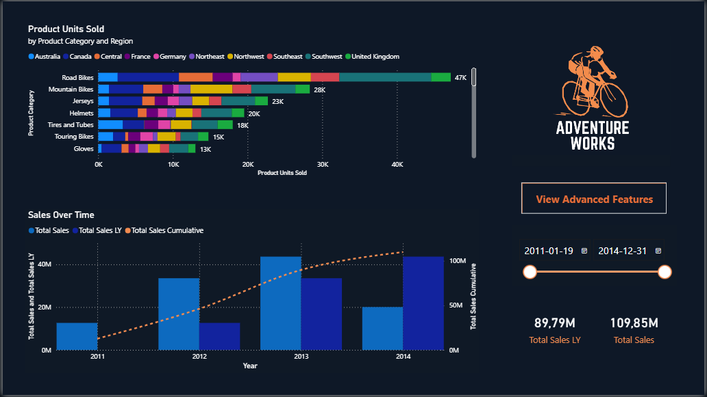
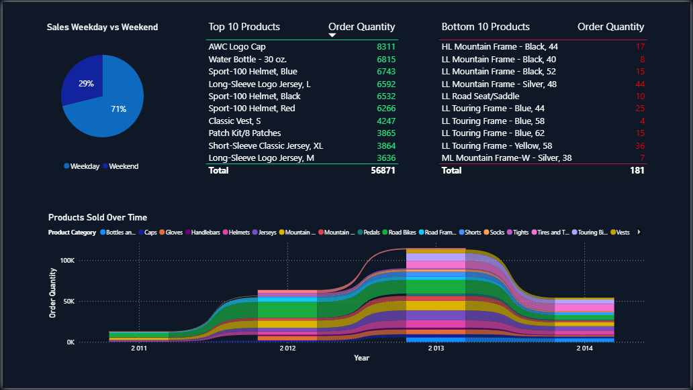
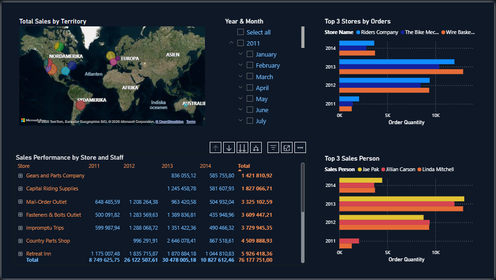
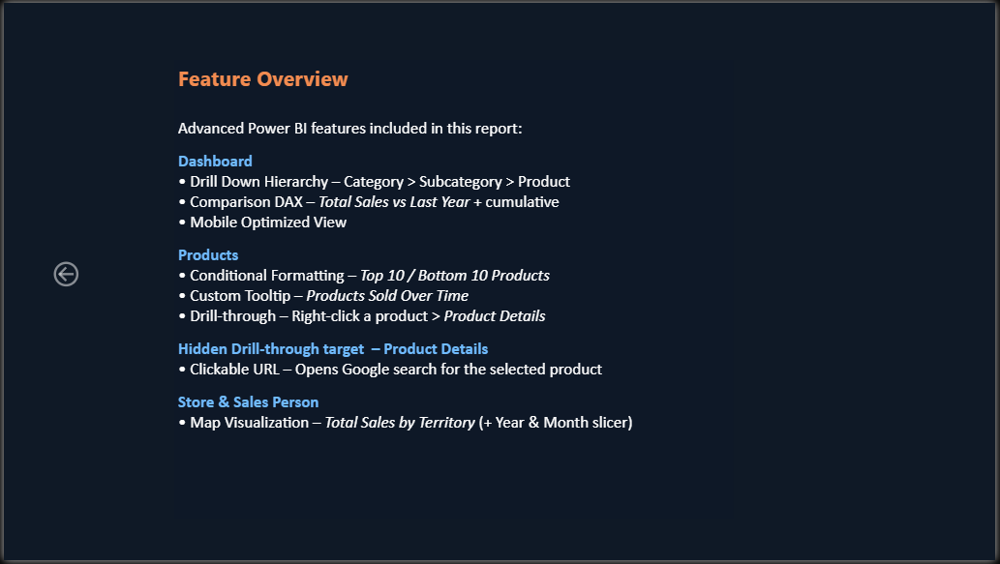

# Power BI AdventureWorks Dashboard

Business intelligence project created as part of my Data Science studies, based on the **AdventureWorks2022** dataset.  
The task was to create an interactive Power BI report with three or more pages using the provided data model without altering its structure, presenting relevant business insights with a focus on high usability and advanced Power BI features.

---

## Project Objectives
- Create a Power BI report with at least three pages, each containing relevant visualizations from the provided AdventureWorks data model.
- Ensure clear presentation and high usability.
- Implement advanced features to enhance interactivity and analysis.

---

## Features Implemented
- **Multiple fact table model (fact constellation)** using `FactSalesOrderDetail` and `FactSalesOrderHeader`.
- Shared dimension tables (Date, Product, Customer, Sales Territory, Sales Person, Special Offer, Sales Reason).
- **Advanced Power BI features** included:
  - Custom drill-down hierarchy (non-date)
  - Drill Through navigation
  - Conditional formatting
  - Custom Tooltips
  - Map visualization
  - Year-over-year comparison with DAX
  - Mobile layout optimization
  - Clickable URLs in visuals
  - Custom theme with consistent color palette for visual identity.

---

## Report Pages
**Dashboard Overview** – KPIs, sales trends, top products, and territory map.
**Products & Customers** – Best-selling products, customer ranking, and category analysis.
**Sales Territories & Salespersons** – Territory performance, salesperson metrics, and detailed drill-through.
**Feature Overview** – Documentation of advanced Power BI features used in the report, with visual examples.

---

## Data Model
- Existing AdventureWorks data model provided in the assignment, used exactly as given without altering the structure or transforming the data.
- Multiple fact table model (fact constellation) sharing common dimension tables.

---

## Key Insights
From the completed dashboard, the following business insights were identified:
- North America is the leading sales territory.
- Road Bikes category generates the highest revenue.
- Peak sales occur during summer months.
- A small number of customers contribute a large portion of total sales.

---

## Download and Open the Report

👉 [power_bi_adventure_works.pbix](./power_bi_adventure_works.pbix)  

You can open the file in **Power BI Desktop**.

---

## Report Preview  
 

### Dashboard  
  
 

### Products 
  
 

### Store & Sales Person  
  
 

### Feature Overview  
  
 

---

## Author  

**Lence Majzovska**  
*Data Science Student @ EC Utbildning 2025*  
